# 📘 Проектування та розробка системи керування рестораном дистанційного харчування

> *Веб-застосунок для управління рестораном, що спеціалізується на дистанційному харчуванні, з можливістю перегляду меню, бронювання столиків, оформлення замовлень для клієнтів та адміністративною панеллю для управління закладом.*

---

## 👤 Автор

- **ПІБ**: Убогий Р. Т.
- **Група**: ФЕІ-43
- **Керівник**: проф. Крупич О. М.
- **Дата виконання**: 2025

---

## 📌 Загальна інформація

- **Тип проєкту**: Вебсайт
- **Мова програмування**: JavaScript (Node.js)
- **Середовище виконання**: Node.js
- **Фреймворк**: Express.js
- **Шаблонізатор**: EJS (Embedded JavaScript templates)
- **База даних**: MySQL
- **ORM**: Sequelize
- **Аутентифікація**: Passport.js (локальна стратегія)
- **Інші бібліотеки**: bcryptjs (хешування паролів), multer (завантаження файлів), express-session, connect-session-sequelize (управління сесіями), connect-flash (сповіщення), dotenv (змінні середовища), method-override (HTTP методи), compression (стиснення).

---

## 🧠 Опис функціоналу

### Для користувачів:
- 🔐 Реєстрація та авторизація.
- 🍽️ Перегляд меню з категоріями та можливістю фільтрації.
- 🛒 Додавання страв до кошика, зміна кількості, видалення позицій.
- 📝 Оформлення замовлень з кошика з вказанням адреси доставки та контактних даних.
- 💳 Вибір способу оплати (готівка або картка) при оформленні замовлення.
- 📅 Бронювання столиків з вибором дати, часу, кількості осіб та можливістю попереднього замовлення страв.
- 👤 Перегляд особистого профілю з історією замовлень та бронювань.
- 📊 Відображення статусу доставки замовлень у профілі.
- ⭐ Можливість залишати відгуки та переглядати відгуки інших користувачів.
- 🚪 Вихід з системи.

### Для адміністраторів (доступ через `/admin` після авторизації):
- 📊 Перегляд панелі адміністратора з посиланнями на розділи управління.
- 🧾 Управління замовленнями: перегляд списку замовлень, зміна статусу (Очікується, В процесі, Доставлено, Скасовано).
- 🗓️ Управління бронюваннями: перегляд списку бронювань, можливість скасування бронювання.
- 🥗 Управління стравами: додавання нових страв (з фото, описом, інгредієнтами, ціною, категорією), видалення страв. Автоматичне додавання нових інгредієнтів до складу.
- 📦 Управління запасами (складом): перегляд поточних залишків, мінімального та максимального запасу; обробка накладних для поповнення запасів; перегляд історії накладних.

---

## 🧱 Опис основних файлів та директорій

| Файл / Директорія       | Призначення                                                                 |
|-------------------------|-----------------------------------------------------------------------------|
| `app.js`                | Головний файл сервера, налаштування Express, middleware, запуск сервера.    |
| `config/database.js`    | Налаштування підключення до бази даних MySQL через Sequelize.               |
| `passport.js`           | Налаштування стратегій аутентифікації Passport.js.                          |
| `routes/`               | Директорія з файлами маршрутизації (`admin.js`, `auth.js`, `booking.js`, `index.js`, `order.js`). |
| `controllers/`          | Директорія з контролерами, що містять логіку обробки запитів (`adminController.js`, `bookingController.js`, `indexController.js`, `orderController.js`). |
| `models/`               | Директорія з моделями Sequelize для взаємодії з базою даних (`User.js`, `Dish.js`, `Order.js`, `Reservation.js`, `CartItem.js`, `Inventory.js`, `Invoice.js`, `Review.js`, `Session.js`). |
| `views/`                | Директорія з EJS шаблонами для генерації HTML сторінок.                      |
| `public/`               | Директорія для статичних файлів (CSS, зображення, клієнтський JavaScript).   |
| `middleware/`           | Директорія з проміжним ПЗ (`isAuthenticated.js`, `isAdmin.js`).              |
| `scripts/addAdmin.js`   | Скрипт для початкового створення адміністратора в БД.                       |
| `syncDatabase.js`       | Скрипт для синхронізації моделей з базою даних (створення/оновлення таблиць).|
| `.env`                  | Файл для зберігання змінних середовища (конфігурація БД, секрети сесій).    |
| `package.json`          | Опис проекту, залежностей та скриптів npm.                                 |

---

## ▶️ Як запустити проєкт "з нуля"

### 1. Встановлення інструментів

- Node.js (рекомендовано LTS версію, наприклад v18.x або v20.x) + npm
- MySQL Server (локально або хмарний сервіс)

### 2. Клонування репозиторію

``bash
git clone https://github.com/s7imKa/RestaurantManagementSystem.git
cd RestaurantManagementSystem

### 3. Встановлення залежностей

npm install

### 4. Налаштування бази даних MySQL

- Запустіть ваш MySQL сервер.
- Створіть базу даних (restaurant).
- Синхронізуйте базу за допомогою Sequelize (заупстіть файл syncDatabase.js - node syncDatabase.js)
- Переконайтеся, що користувач MySQL має необхідні права доступу до цієї бази даних.

### 5. Створення .env файлу

Створіть файл .env в кореневій директорії проекту та додайте наступні змінні, замінивши значення на ваші:

DB_NAME=restaurant
DB_USER=your_mysql_user
DB_PASSWORD=your_mysql_password
DB_HOST=localhost
DB_PORT=3306
DB_DIALECT=mysql

SESSION_SECRET=your_strong_session_secret_key_here
PORT=3000
NODE_ENV=development # або production для розгортання

### 6. Синхронізація бази даних та створення таблиць

Цей скрипт створить таблиці у вашій базі даних на основі моделей Sequelize.
Увага: syncDatabase.js у вашому проекті використовує { force: true }, що видалить існуючі таблиці перед створенням нових. Для першого запуску це нормально, але для оновлень використовуйте { alter: true } або систему міграцій.

node syncDatabase.js

### 7. Створення початкового адміністратора

Цей скрипт додасть користувача "admin" з паролем "1111" (рекомендовано змінити пароль у скрипті на більш надійний перед запуском або після першого входу).

node scripts/addAdmin.js

### 8. Запуск проєкту

npm start

Додаток буде доступний за адресою http://localhost:3000 (або іншим портом, вказаним у .env).

---

## 🔌 Приклади взаємодії (основні HTTP запити)

Оскільки проєкт використовує серверний рендеринг з EJS, "API" тут переважно представлене як обробка форм.

### 🔐 Аутентифікація

**POST `/auth/register`**
- **Тип запиту**: Form data
- **Поля**: `username`, `email`, `password`, `confirmPassword`
- **Призначення**: Реєстрація нового користувача.

**POST `/auth/login`**
- **Тип запиту**: Form data
- **Поля**: `email`, `password`
- **Призначення**: Авторизація існуючого користувача.

**GET `/auth/logout`**
- **Призначення**: Вихід користувача з системи.

---

### 🛒 Кошик та Замовлення

**POST `/order/addToCart`**
- **Тип запиту**: Form data
- **Поля**: `dishName`, `dishPrice`, `quantity` (опціонально, за замовчуванням 1)
- **Призначення**: Додавання страви до кошика поточного користувача.

**POST `/order/checkout`**
- **Тип запиту**: Form data
- **Поля**: `customerName`, `city`, `street`, `houseNumber`, `apartmentNumber` (опціонально), `phoneNumber`, `paymentMethod`, `cardNumber` (якщо картка), `cardExpiry` (якщо картка), `cardCvv` (якщо картка)
- **Призначення**: Оформлення замовлення з товарів у кошику.

**POST `/order/cart/:id/remove`**
- **Призначення**: Видалення позиції з кошика.

**POST `/order/cart/:id/update`**
- **Тип запиту**: Form data
- **Поля**: `quantity`
- **Призначення**: Оновлення кількості товару в кошику.

---

### 📅 Бронювання

**POST `/booking`**
- **Тип запиту**: Form data
- **Поля**: `customerName`, `tableNumber`, `date`, `time`, `people`, `preOrder` (опціонально)
- **Призначення**: Створення нового бронювання.

---

### 👑 Адмін-панель

**POST `/admin/addDish`**
- **Тип запиту**: Multipart form-data (через `multer` для завантаження фото)
- **Поля**: `name`, `description`, `ingredients`, `price`, `category`, `available`, `imageUrl` (файл)
- **Призначення**: Додавання нової страви.

**POST `/admin/deleteDish/:id`**
- **Призначення**: Видалення страви.

**POST `/admin/updateOrder/:id`**
- **Тип запиту**: Form data
- **Поля**: `status`
- **Призначення**: Оновлення статусу замовлення.

**POST `/admin/inventory/process`**
- **Тип запиту**: Form data
- **Поля**: `invoice[productName]=amount` (динамічні поля для накладної)
- **Призначення**: Обробка накладної для поповнення складу.

---

## 🖱️ Інструкція для користувача

1.  **Головна сторінка (`/`)**:
    -   Перегляд меню, згрупованого за категоріями.
    -   Фільтрація страв за допомогою кнопок категорій.
    -   Додавання страв до кошика кнопкою "+" біля кожної страви.
    -   Перегляд секції "Про нас".
    -   Залишення відгуків та перегляд існуючих у каруселі.
    -   Навігація: "Замовити столик", "Про нас", "Відгуки", "Меню", "Вхід/Вихід", "Адмін" (для адміна), "Профіль" (для користувача), "Кошик" (для користувача).

2.  **Реєстрація (`/auth/register`)**:
    -   Введіть ім'я користувача, email, пароль та підтвердження пароля.
    -   Натисніть "Зареєструватися".

3.  **Вхід (`/auth/login`)**:
    -   Введіть email та пароль.
    -   Натисніть "Увійти".

4.  **Кошик (`/cart`)**:
    -   Перегляд доданих страв, їх кількості та ціни.
    -   Зміна кількості товарів кнопками "+" та "-".
    -   Видалення позиції з кошика.
    -   Перегляд загальної суми.
    -   Заповнення форми для оформлення замовлення: ім'я, адреса доставки, телефон.
    -   Вибір способу оплати (готівка/картка). При виборі картки з'являться поля для введення даних картки.
    -   Натискання "Оформити замовлення".

5.  **Бронювання столиків (`/booking`)**:
    -   Вибір дати, часу, кількості осіб.
    -   Введення імені для бронювання.
    -   Вибір столика на інтерактивній карті ресторану (зайняті столики позначені).
    -   Можливість додати попереднє замовлення (наприклад, напої, квіти).
    -   Натискання "Забронювати".

6.  **Профіль (`/profile`)**:
    -   Доступний після авторизації.
    -   Перегляд історії замовлень з їх поточним статусом доставки (візуалізовано таймлайном).
    -   Перегляд активних бронювань з можливістю їх скасування.

7.  **Панель адміністратора (`/admin`)**:
    -   Доступна тільки для користувачів з правами адміністратора.
    -   **Замовлення (`/admin/orders`)**: Перегляд усіх замовлень, згрупованих за датою та часом. Можливість зміни статусу кожного замовлення.
    -   **Список меню (`/admin/dishes`)**: Додавання нових страв (з фото), перегляд існуючих, видалення страв.
    -   **Бронювання (`/admin/reservations`)**: Перегляд усіх бронювань, можливість їх скасування.
    -   **Склад (`/admin/inventory`)**: Перегляд поточних запасів, поповнення запасів через створення та обробку накладних, перегляд історії накладних.

---

## 📷 Приклади / скриншоти

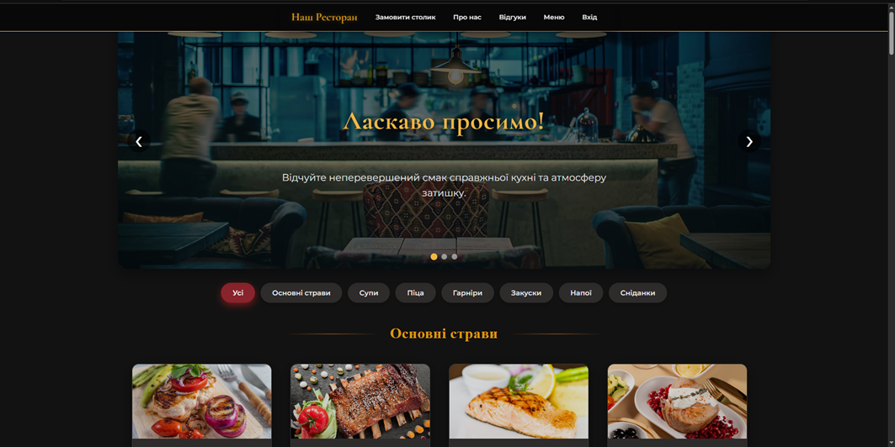
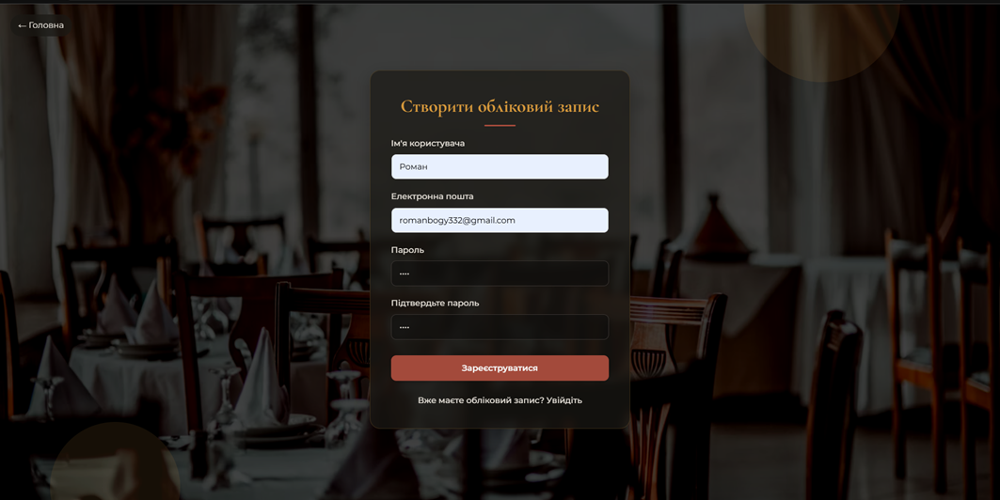
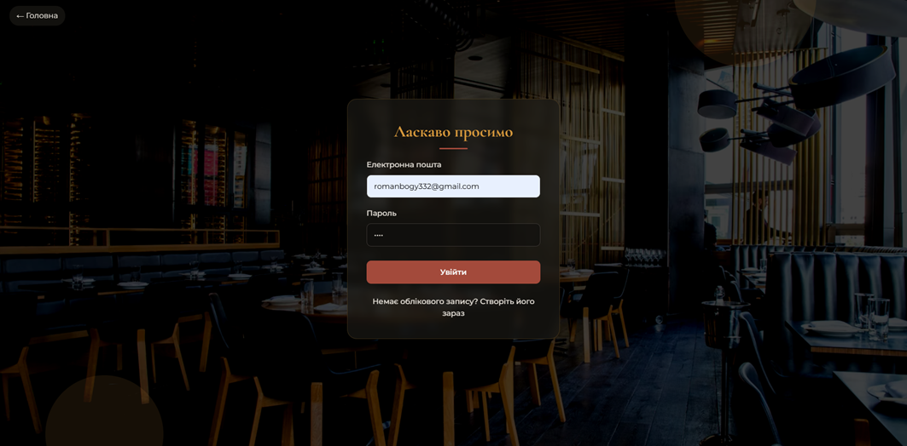
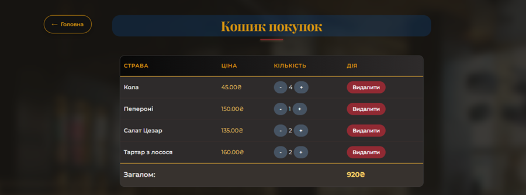

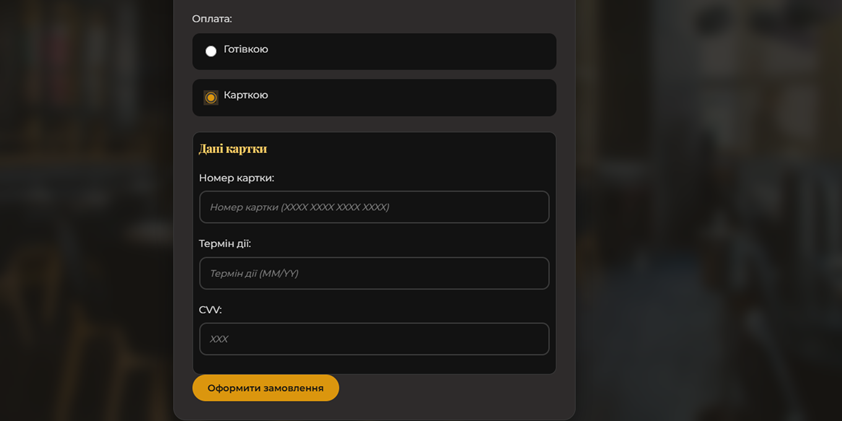

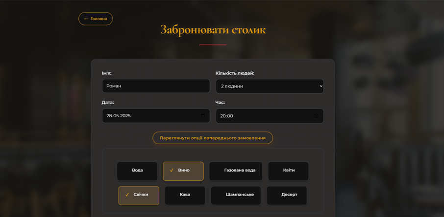
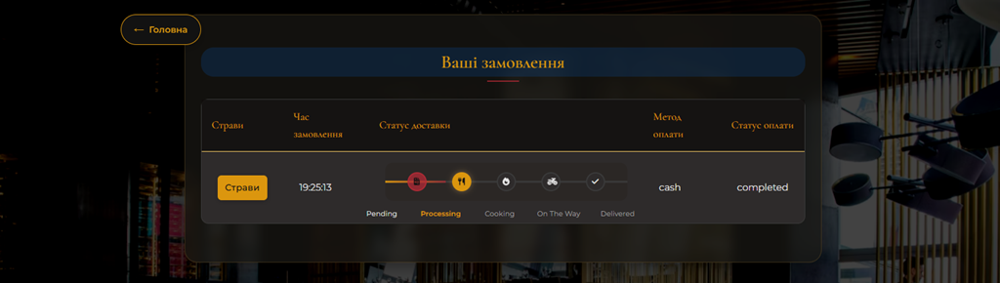
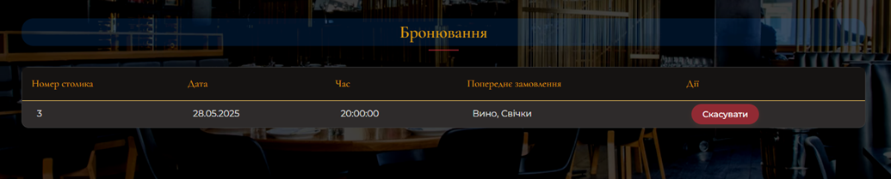
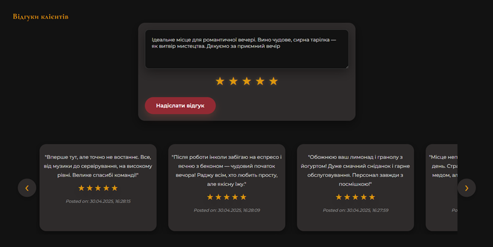
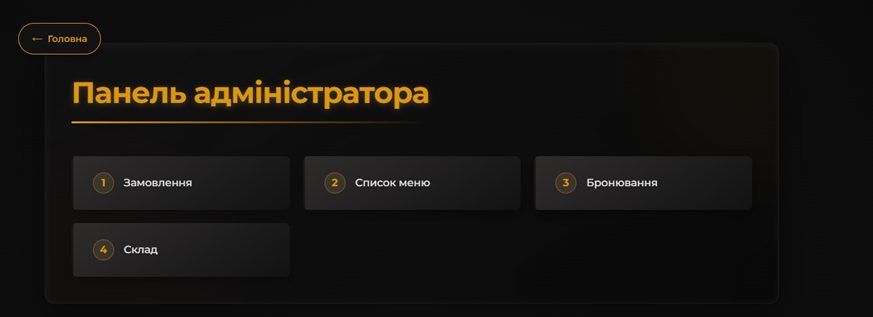
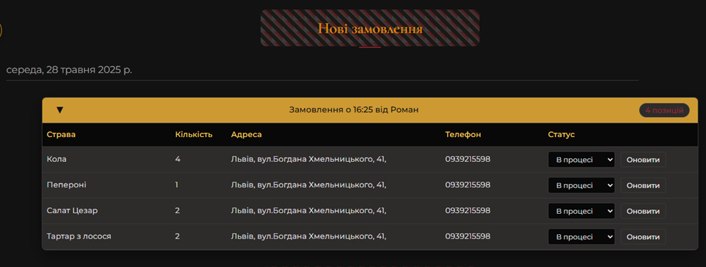
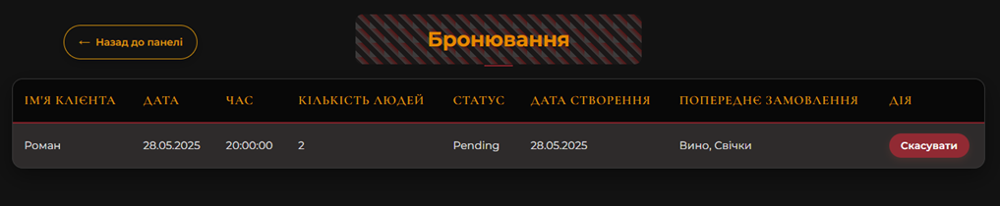
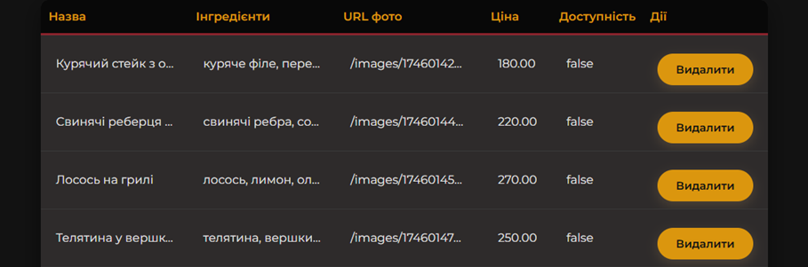

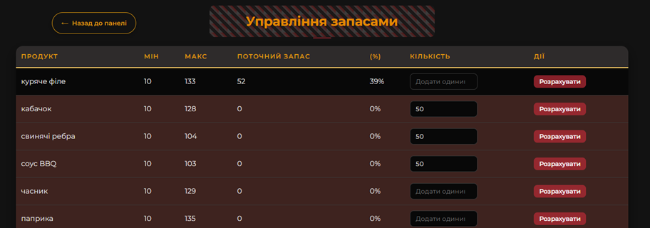
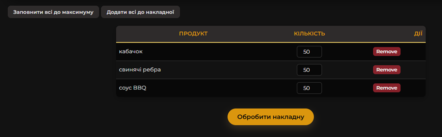
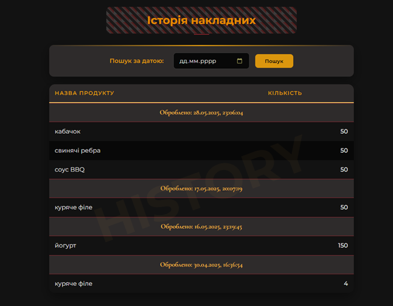
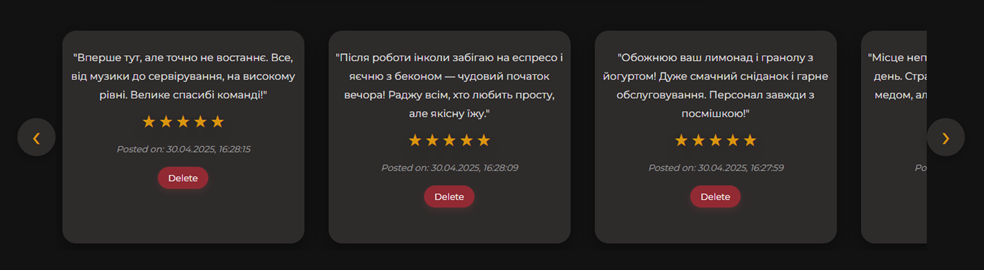

---

## 🧪 Проблеми і рішення (приклади)

| Проблема                                  | Рішення                                                                                                                               |
|-------------------------------------------|---------------------------------------------------------------------------------------------------------------------------------------|
| Помилка підключення до БД MySQL            | Перевірити правильність даних у `.env` (`DB_NAME`, `DB_USER`, `DB_PASSWORD`, `DB_HOST`, `DB_PORT`). Перевірити, чи запущено MySQL сервер. |
| `syncDatabase.js` видаляє дані            | Для розробки це може бути прийнятно. Для продакшену або збереження даних змінити `sequelize.sync({ force: true })` на `sequelize.sync({ alter: true })` або використовувати систему міграцій Sequelize. |
| Не вдається завантажити зображення страв  | Перевірити налаштування `multer` в `adminController.js` та існування папки `public/images/`. Перевірити права на запис у цю папку.       |
| Сесії не зберігаються / користувач "вилітає" | Перевірити налаштування `express-session` та `connect-session-sequelize` в `app.js`, зокрема `SESSION_SECRET` та параметри cookie. |
| Доступ до адмін-панелі без авторизації  | Перевірити правильність роботи middleware `isAuthenticated` та `isAdmin` у файлах маршрутизації.                                     |

---

## 🧾 Використані джерела / література

3.  Node.js Офіційна документація – [https://nodejs.org/uk/docs/]
4.  The Modern JavaScript Tutorial – [https://javascript.info/]
5.  Express.js – Веб-фреймворк для Node.js – [https://expressjs.com/uk/]
6.  Sequelize ORM – [https://sequelize.org/master/]
7.  MySQL – [https://dev.mysql.com/doc/]
8.  W3Schools. HTML Tutorial – [https://www.w3schools.com/html/]
9.  W3Schools. JavaScript Tutorial – [https://www.w3schools.com/js/]
10. EJS – Embedded JavaScript templating – [https://ejs.co/]
11. Passport.js – Authentication for Node.js – [http://www.passportjs.org/]
12. CSS-Tricks. Статті, гайди та техніки CSS – [https://css-tricks.com/]

---